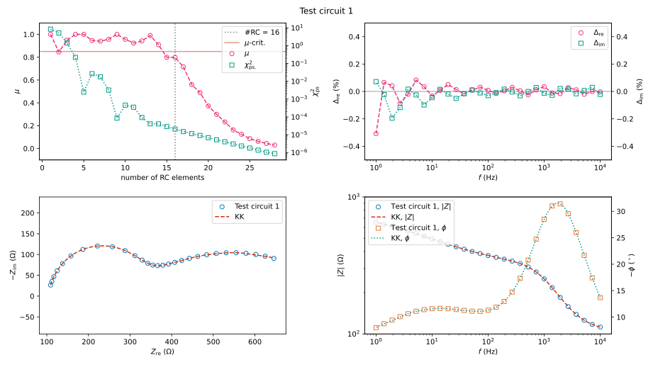
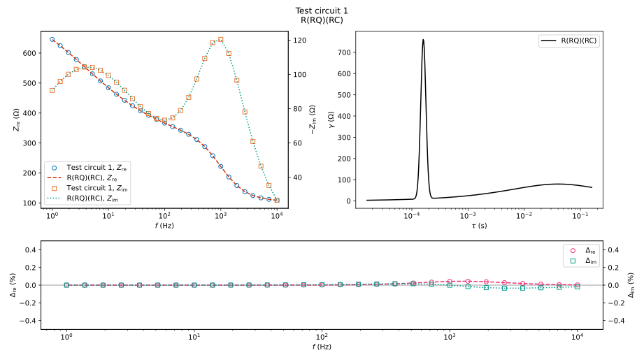
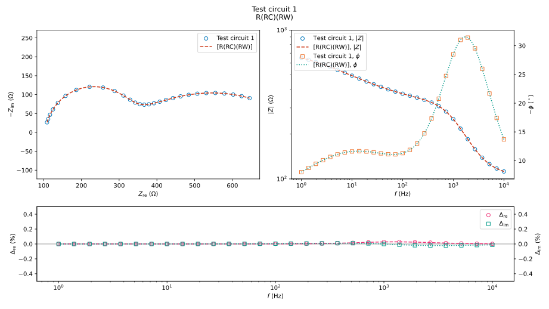
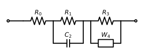

[](https://github.com/vyrjana/pyimpspec/actions/workflows/test-package.yml)
[](https://github.com/vyrjana/pyimpspec/actions/workflows/test-wheel.yml)

[](https://www.gnu.org/licenses/gpl-3.0.html)
[](https://pypi.org/project/pyimpspec/)


pyimpspec is a Python package that implements an application programming interface (API) for working with impedance spectra.
The target audience is researchers who use electrochemical impedance spectroscopy (EIS) though the program may also be useful in educational settings.
pyimpspec includes features such as:

- reading experimental data from multiple different file formats such as:
	- BioLogic: `.mpt`
	- Eco Chemie: `.dfr`
	- Gamry: `.dta`
	- Ivium: `.idf` and `.ids`
	- Spreadsheets: `.xlsx` and `.ods`
	- Plain-text character-separated values (CSV)
- validation of impedance spectra by checking if the data is Kramers-Kronig transformable
- calculation of the distribution of relaxation times (DRT)
- construction of equivalent circuits by parsing a circuit description code (CDC)
- equivalent circuit fitting as a means of extracting quantitative data
- simulation of impedance spectra
- basic visualization of impedance spectra using, e.g., Bode and Nyquist plots

Check out [this Jupyter notebook](https://github.com/vyrjana/pyimpspec/blob/main/examples/examples.ipynb) for examples of how to use the API.
Check out [DearEIS](https://vyrjana.github.io/DearEIS/), which is based on pyimpspec, if you would prefer to use a program with a graphical user interface (GUI).




Figure: Example of the included visualization of exploratory Kramers-Kronig testing. The testing was performed using the complex form of the [linear Kramers-Kronig test](https://doi.org/10.1149/1.2044210) and a tweaked version of [an algorithm](https://doi.org/10.1016/j.electacta.2014.01.034) for determining an appropriate number of parallel RC circuits to use. The impedance spectrum corresponds to test circuit 1 from [this article](https://doi.org/10.1149/1.2044210).




Figure: Example of the included visualization of the distribution of relaxation times (DRT). The DRT was calculated using the multi-(RQ)-fit method described in these articles: [Boukamp (2015)](https://doi.org/10.1016/j.electacta.2014.12.059) and [Boukamp & Rolle (2017)](https://doi.org/10.1016/j.ssi.2016.10.009). The impedance spectrum corresponds to test circuit 1 from [this article](https://doi.org/10.1149/1.2044210).




Figure: Example of the included visualization of a fitted equivalent circuit. The impedance spectrum corresponds to test circuit 1 from [this article](https://doi.org/10.1149/1.2044210).




Figure: Example of a circuit diagram that was generated for the circuit that was fitted in the previous figure.


## Recent news

<ul>
  
    <li>
      <a href="{{ site.baseurl }}{{ post.url }}">{{ post.title }} ({{ post.date | date: "%Y-%m-%d" }})</a>
    </li>
  
</ul>

[Archive](archive.md)


## How to install

### Requirements

- [Python (version 3.8 or later)](https://www.python.org/)

Check the GitHub repository for more information about the required and optional dependencies.


### Supported platforms

- Linux
- Windows
- MacOS


### Step-by-step

- Make sure to first install a recent version of Python if you do not already have it installed.
- Install pyimpspec using [pip](https://pip.pypa.io/en/stable/), which is the package installer for Python and should be included with most distributions of the official Python runtime.
Open a terminal (e.g., PowerShell on Windows) and execute the following command.

```
pip install pyimpspec
```


### Updating

Updating pyimpspec can be done by executing the following command:

```
pip install --upgrade pyimpspec
```


## How to use

The pyimpspec package should now be importable in, e.g., a Python script or a Jupyter notebook.
Check out [this Jupyter notebook](https://github.com/vyrjana/pyimpspec/blob/main/examples/examples.ipynb) for examples of how to use the various functions and classes.

[The API documentation can be found here](https://vyrjana.github.io/pyimpspec/api)


## Support

Bug reports, feature requests, and requests for help can be posted on [GitHub](https://github.com/vyrjana/pyimpspec/issues).


## Contributing

If you wish to help make pyimpspec even better, then please head on over to the [GitHub repository](https://github.com/vyrjana/pyimpspec) for more information in the README.md file.


## License

pyimpspec is licensed under the [GPLv3 or later](https://www.gnu.org/licenses/gpl-3.0.html).

The licenses of pyimpspec's dependencies and/or sources of portions of code are included in the [LICENSES folder on GitHub](https://github.com/vyrjana/pyimpspec/tree/main/LICENSES).
